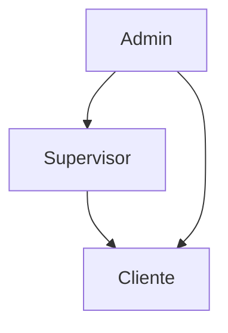

# 💼 Financial Simulator Platform

Una plataforma moderna de simulación financiera construida con **Next.js 16**, **TypeScript**, **Tailwind CSS** y **Radix UI**, que permite a diferentes tipos de usuarios gestionar simulaciones de inversión con un sistema de roles jerárquico.

## 🚀 Características Principales

- 🔐 **Sistema de Autenticación** con roles jerárquicos (Cliente, Supervisor, Admin)
- 👥 **Gestión de Usuarios** con permisos granulares
- 📊 **Simulador Financiero** para proyección de inversiones
- 💼 **Panel de Administración** multi-rol
- 📱 **Diseño Responsivo** optimizado para todos los dispositivos
- 🎨 **UI/UX Moderna** con componentes reutilizables
- 🔄 **Estado Global** con Context API de React
- ✅ **Validación de Formularios** con Formik y Yup

## 📋 Requisitos Previos

- **Node.js** >= 18.0.0
- **npm** o **yarn**
- **Git**

## 🛠️ Instalación y Configuración

### 1. Clonar el Repositorio

```bash
git clone https://github.com/oscar2001ds/test-w-front.git
cd test-w-front
```

### 2. Instalar Dependencias

```bash
npm install
# o
yarn install
```

### 3. Configurar Variables de Entorno

Copia el archivo de ejemplo y configura las variables:

```bash
cp .env.example .env
```

Edita el archivo `.env` con las configuraciones necesarias:

```bash
# URL de la API backend
NEXT_PUBLIC_API_URL=http://localhost:4000
```

### 4. Ejecutar el Proyecto

#### Modo Desarrollo
```bash
npm run dev
# o
yarn dev
```

#### Modo Producción
```bash
# Compilar el proyecto
npm run build
# o
yarn build

# Ejecutar en producción
npm run start
# o
yarn start
```

La aplicación estará disponible en: **http://localhost:3000**

## 📁 Estructura del Proyecto

```
test-w-front/
├── 📄 README.md                    # Este archivo
├── 📄 package.json                 # Dependencias y scripts
├── 📄 .env.example                 # Variables de entorno de ejemplo
├── 📄 tailwind.config.ts           # Configuración de Tailwind CSS
├── 📄 next.config.ts               # Configuración de Next.js
├── 📄 tsconfig.json                # Configuración de TypeScript
├── 📄 eslint.config.mjs            # Configuración de ESLint
├── 📄 middleware.ts                # Middleware de Next.js (redirecciones)
├── 📁 public/                      # Archivos estáticos
├── 📁 docs/                        # Documentación adicional
└── 📁 src/                         # Código fuente principal
    ├── 📁 app/                     # Router de Next.js 13+ (App Router)
    │   ├── 📄 layout.tsx           # Layout principal de la app
    │   ├── 📄 page.tsx             # Página de inicio
    │   ├── 📄 globals.css          # Estilos globales
    │   ├── 📁 auth/                # Rutas de autenticación
    │   └── 📁 financial-simulator/ # Rutas del simulador
    ├── 📁 core/                    # Funcionalidades centrales
    │   ├── 📁 config/              # Configuraciones globales
    │   ├── 📁 context/             # Contexts de React
    │   ├── 📁 types/               # Tipos TypeScript globales
    │   └── 📁 utils/               # Utilidades generales
    ├── 📁 shared/                  # Componentes y recursos compartidos
    │   ├── 📁 components/          # Componentes UI reutilizables
    │   │   └── 📁 ui/              # Sistema de diseño (shadcn/ui)
    │   ├── 📁 hooks/               # Hooks personalizados
    │   └── 📁 utils/               # Utilidades compartidas
    └── 📁 modules/                 # Módulos de funcionalidad
        ├── 📁 auth/                # Módulo de autenticación
        │   ├── 📁 components/      # Componentes del módulo
        │   ├── 📁 hooks/           # Hooks específicos
        │   ├── 📁 services/        # Servicios/API calls
        │   └── 📁 types/           # Tipos del módulo
        └── 📁 financial-simulator/ # Módulo principal del simulador
            ├── 📁 components/      # Componentes del módulo
            │   ├── 📁 usersView/   # Vista de gestión de usuarios
            │   ├── 📁 myProfileView/ # Vista de perfil personal
            │   └── 📁 simulatorView/ # Vista del simulador
            ├── 📁 hooks/           # Hooks del simulador
            ├── 📁 services/        # Servicios/API calls
            ├── 📁 types/           # Tipos del simulador
            └── 📁 constants/       # Constantes y configuraciones
```

## 🏗️ Arquitectura del Proyecto

### 🔧 Stack Tecnológico

- **Framework**: Next.js 16 con App Router
- **Lenguaje**: TypeScript
- **Estilos**: Tailwind CSS + CSS Modules
- **Componentes**: Radix UI + shadcn/ui
- **Formularios**: Formik + Yup
- **Iconos**: Lucide React + React Icons
- **Notificaciones**: React Hot Toast
- **Animaciones**: AOS (Animate On Scroll)

### 🎯 Patrones de Diseño

#### **1. Arquitectura Modular**
```typescript
// Cada módulo es independiente y autocontenido
modules/
├── auth/           # Autenticación y autorización
└── financial-simulator/ # Funcionalidad principal
```

#### **2. Sistema de Componentes Reutilizables**
```typescript
// Componentes base en shared/components/ui/
import { Button } from '@/shared/components/ui/button'
import { Dialog } from '@/shared/components/ui/dialog'
```

#### **3. Hooks Personalizados**
```typescript
// Lógica de estado encapsulada en hooks
const { users, updateFilters, changeUserRole } = useUsersView(userType)
```

#### **4. Tipos TypeScript Estrictos**
```typescript
// Tipado completo para mejor DX
interface UserData {
  id: string
  role: 'client' | 'supervisor' | 'admin'
  isActive: boolean
}
```

## 👥 Sistema de Roles y Permisos

### 🔐 Jerarquía de Roles



| Rol | Permisos | Descripción |
|-----|----------|-------------|
| **Admin** | 🔧 Gestión completa | Puede gestionar supervisores y clientes |
| **Supervisor** | 👀 Gestión limitada | Puede gestionar solo clientes |
| **Cliente** | 📊 Solo simulaciones | Acceso únicamente a sus simulaciones |

### 🚪 Rutas Protegidas

```typescript
// Configuración en src/core/config/protected-routes.ts
const roleAccess = {
  '/financial-simulator/admins': ['admin'],
  '/financial-simulator/supervisors': ['admin', 'supervisor'], 
  '/financial-simulator/clients': ['admin', 'supervisor'],
  '/financial-simulator/home': ['admin', 'supervisor', 'client']
}
```

## 🧩 Componentes Principales

### **🏠 Vista de Dashboard**
```typescript
// Estadísticas generales y navegación
<UsersOverview stats={overviewStats} isLoading={isLoading} />
```

### **👤 Gestión de Usuarios**
```typescript
// Sistema completo de CRUD de usuarios
<UsersView userType="clients" /> // Dinámico por tipo de usuario
```

### **⚙️ Modal de Edición**
```typescript
// Edición con limitaciones por rol
<EditionModal 
  user={selectedUser}
  onConfirm={(user, updates) => handleUserUpdate(user, updates)}
/>
```

### **🔍 Filtros Inteligentes**
```typescript
// Búsqueda y filtrado en tiempo real
<UserFilters 
  filters={filters}
  onFiltersChange={updateFilters}
/>
```

## 🎨 Sistema de Diseño

### **🎨 Colores por Rol**
```typescript
const ROLE_COLORS = {
  client: 'bg-blue-100 text-blue-800',
  supervisor: 'bg-green-100 text-green-800', 
  admin: 'bg-purple-100 text-purple-800'
}
```

### **📱 Breakpoints Responsivos**
```css
/* Configuración Tailwind */
sm: '640px'   /* Tablet */
md: '768px'   /* Desktop pequeño */
lg: '1024px'  /* Desktop mediano */
xl: '1280px'  /* Desktop grande */
```

## 🔧 Scripts Disponibles

```bash
# Desarrollo
npm run dev          # Servidor de desarrollo

# Producción
npm run build        # Compilar para producción
npm run start        # Servidor de producción

# Calidad de Código
npm run lint         # Ejecutar ESLint
```

## 🌐 Variables de Entorno

| Variable | Descripción | Ejemplo |
|----------|-------------|---------|
| `NEXT_PUBLIC_API_URL` | URL del backend API | `http://localhost:4000` |

> ⚠️ **Importante**: Crea un archivo `.env` basado en `.env.example` antes de ejecutar el proyecto.

## 🚀 Despliegue

### **Vercel (Recomendado)**
```bash
# Instalar Vercel CLI
npm i -g vercel

# Desplegar
vercel
```

### **Build Manual**
```bash
npm run build
npm run start
```

## 🤝 Contribución

1. Fork el repositorio
2. Crea una rama feature (`git checkout -b feature/nueva-funcionalidad`)
3. Commit tus cambios (`git commit -m 'Agregar nueva funcionalidad'`)
4. Push a la rama (`git push origin feature/nueva-funcionalidad`)
5. Abre un Pull Request

## 📝 Convenciones de Código

- **Componentes**: PascalCase (`UserCard.tsx`)
- **Hooks**: camelCase con prefijo `use` (`useUsersView.ts`)
- **Tipos**: PascalCase con sufijo (`UserData`, `UsersViewProps`)
- **Constantes**: UPPER_SNAKE_CASE (`ROLE_COLORS`)

## 🐛 Troubleshooting

### **Problema**: Error de compilación TypeScript
```bash
# Limpiar caché de TypeScript
rm -rf .next
npm run dev
```

### **Problema**: Estilos no se cargan
```bash
# Verificar que Tailwind esté configurado
npm run build
```

## 📄 Licencia

Este proyecto está bajo la licencia MIT. Ver `LICENSE` para más detalles.

## 📞 Soporte

Para reportar bugs o solicitar funcionalidades:
- 📧 Email: [tu-email@ejemplo.com]
- 🐛 Issues: [GitHub Issues](https://github.com/oscar2001ds/test-w-front/issues)

---

**Desarrollado con ❤️ usando Next.js y TypeScript**
